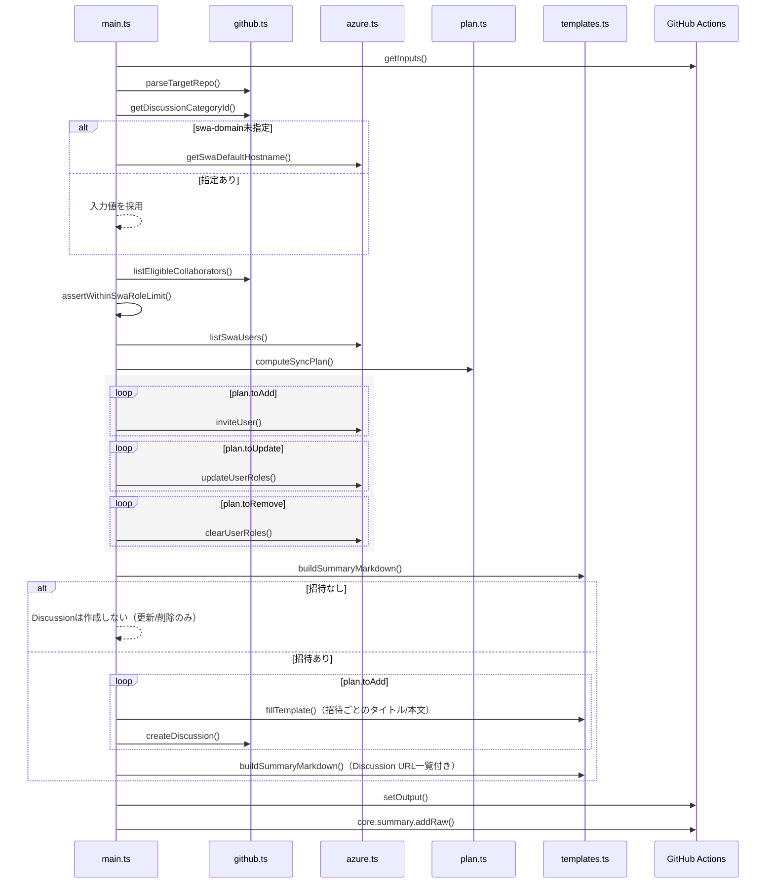
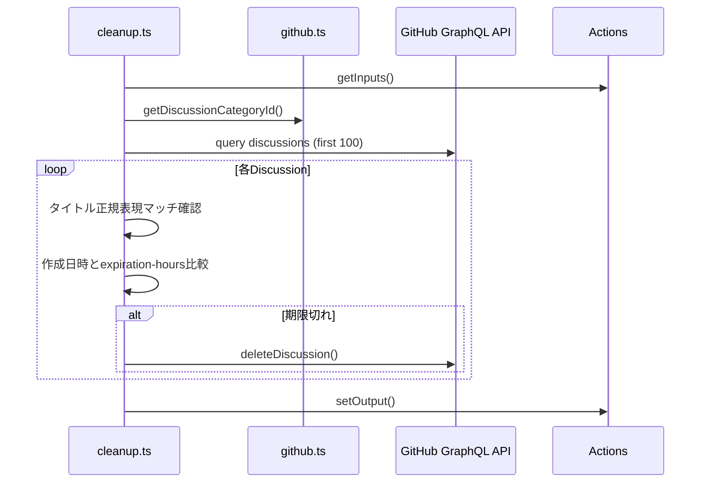

# Architecture（Japanese）

[English version / 英語版](architecture.md)

## 全体像

`swa-github-role-sync`はGitHubリポジトリの権限をAzure Static Web Appsのカスタムロールへ同期し、招待リンクをユーザーごとのDiscussionに投稿しつつ、集計サマリーをGitHub ActionsのJobサマリーへ出力するJavaScript Actionです。エントリーポイントは`src/main.ts`で、TypeScriptソースをRollupで`dist/`にバンドルしGitHub Actionsランナーで実行します。

## モジュール役割

- `src/main.ts`: 入力取得・差分計算・招待/更新/削除の実行・出力/サマリー書き出しまでのオーケストレーター。
- `src/github.ts`: Octokit/GraphQLを使って協働者一覧取得、DiscussionカテゴリID解決、Discussion作成を担当。
- `src/azure.ts`: `az staticwebapp ...`コマンド呼び出しをラップし、SWAユーザー取得と招待/ロール更新/削除を実行。
- `src/plan.ts`: GitHub側希望状態とSWA現状から招待・更新・削除の差分プランを生成（ロール接頭辞の正規化や大小文字差異を吸収）。
- `src/templates.ts`: Discussionテンプレート埋め込みと同期サマリーMarkdown生成を担当。
- `src/cleanup.ts`: 有効期限切れのDiscussionを特定し、削除を実行するクリーンアップロジック。
- `src/types.ts`: GitHubロールやSWAユーザー、差分プランの型定義。

## 呼び出しシーケンス（正常系）

エラー発生時は`catch`でサマリーを`status: failure`に差し替え、`core.setFailed`でジョブを失敗させます。Discussion作成前に失敗した場合でもJobサマリーには結果が残ります。

## クリーンアップアクションのシーケンス

## データフローと外部API

- GitHub: REST APIでコラボレーターを取得し、GraphQLでDiscussionカテゴリIDとDiscussion作成を行う。`github-token`入力がすべての呼び出しに使用される。
- Azure: `execFile`で`az staticwebapp users list/invite/update`や`az staticwebapp show`を実行し、JSON/TSV出力を解析する。プロバイダーは`GitHub`に限定。
- 出力: `buildSummaryMarkdown`が招待URLや更新/削除リストをMarkdown化し、`GITHUB_STEP_SUMMARY`で集計を共有する。個別Discussionの本文は`fillTemplate`を通じて`@{login}`や招待リンクを挿入する。

## 差分ロジックと制約

- `role-prefix`に一致しないSWAロールは同期対象外とし、GitHub側で保持するロール文字列も小文字・ソート済みで比較する。
- SWAのカスタムロール割り当て上限（25名）超過を`assertWithinSwaRoleLimit`で早期検出し、API呼び出し前にエラーを返す。
- Discussion本文テンプレートに未知のプレースホルダーが含まれていてもテンプレート置換は続行し、警告ログのみを出力する。
