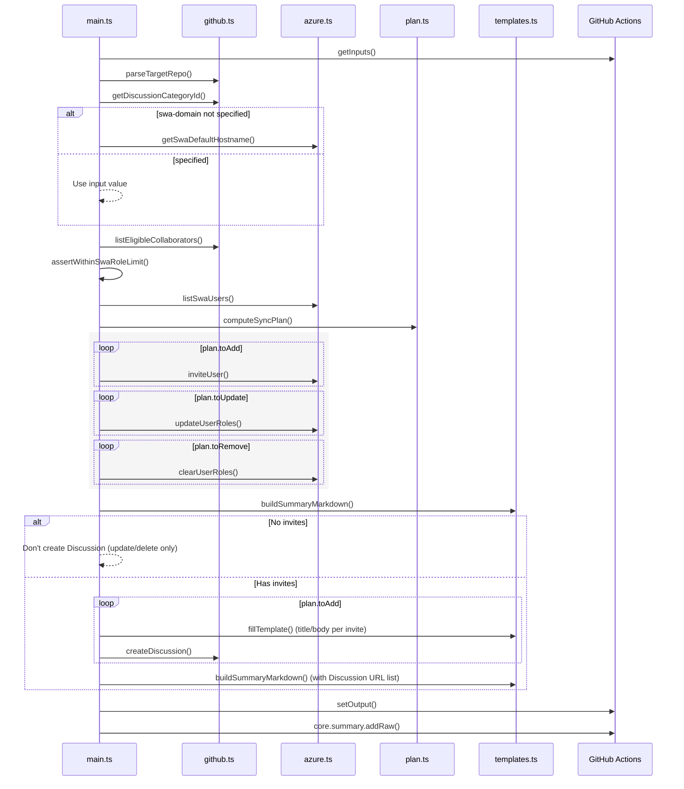
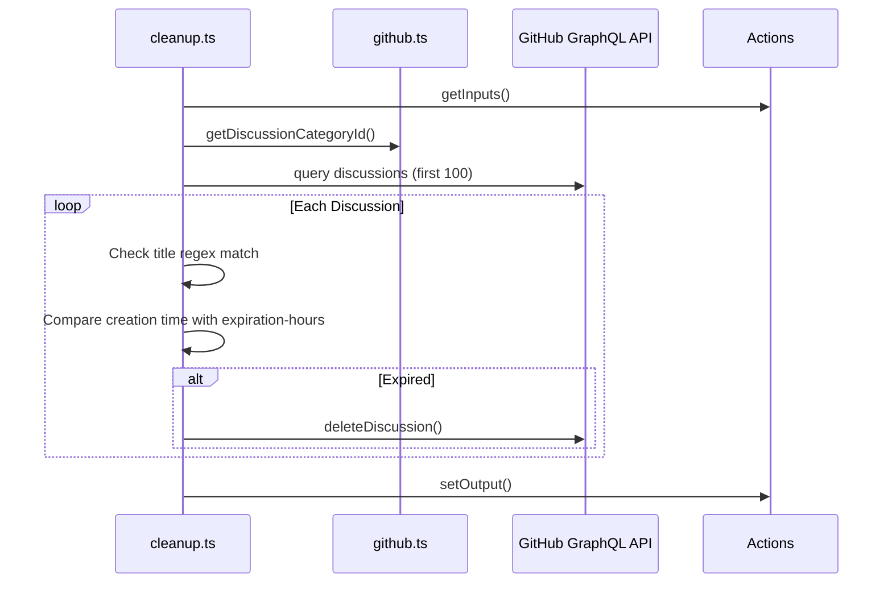

# Architecture

[日本語版 / Japanese version](architecture.ja.md)

## Overview

`swa-github-role-sync` is a JavaScript Action that synchronizes GitHub repository permissions to Azure Static Web Apps custom roles, posts invitation links to user-specific Discussions, and outputs aggregate summaries to the GitHub Actions Job Summary. The entry point is `src/main.ts`, bundling TypeScript sources to `dist/` with Rollup for execution on GitHub Actions runners.

## Module Roles

- `src/main.ts`: Orchestrator handling input retrieval, diff calculation, invite/update/delete execution, and output/summary writing.
- `src/github.ts`: Handles collaborator list retrieval, Discussion category ID resolution, and Discussion creation using Octokit/GraphQL.
- `src/azure.ts`: Wraps `az staticwebapp ...` command calls to execute SWA user retrieval, invitation, role updates, and deletion.
- `src/plan.ts`: Generates invite/update/delete diff plan from GitHub desired state and SWA current state (normalizes role prefix and absorbs case differences).
- `src/templates.ts`: Handles Discussion template embedding and sync summary Markdown generation.
- `src/cleanup.ts`: Cleanup logic to identify and delete expired Discussions.
- `src/types.ts`: Type definitions for GitHub roles, SWA users, and diff plans.

## Call Sequence (Normal Flow)

On error, `catch` replaces summary with `status: failure` and fails job with `core.setFailed`. Even if failure occurs before Discussion creation, results remain in Job summary.

## Cleanup Action Sequence

## Data Flow and External APIs

- GitHub: Retrieve collaborators with REST API, perform Discussion category ID and Discussion creation with GraphQL. All calls use `github-token` input.
- Azure: Execute `az staticwebapp users list/invite/update` and `az staticwebapp show` with `execFile`, parsing JSON/TSV output. Provider limited to `GitHub`.
- Output: `buildSummaryMarkdown` converts invitation URLs and update/delete lists to Markdown, sharing aggregates via `GITHUB_STEP_SUMMARY`. Individual Discussion body inserts `@{login}` and invitation links through `fillTemplate`.

## Diff Logic and Constraints

- SWA roles not matching `role-prefix` are excluded from sync targets, and role strings held on GitHub side are compared lowercase and sorted.
- Detects SWA custom role assignment limit (25 users) excess early with `assertWithinSwaRoleLimit`, returning error before API calls.
- If unknown placeholders are included in Discussion body template, template replacement continues with only warning log output.
